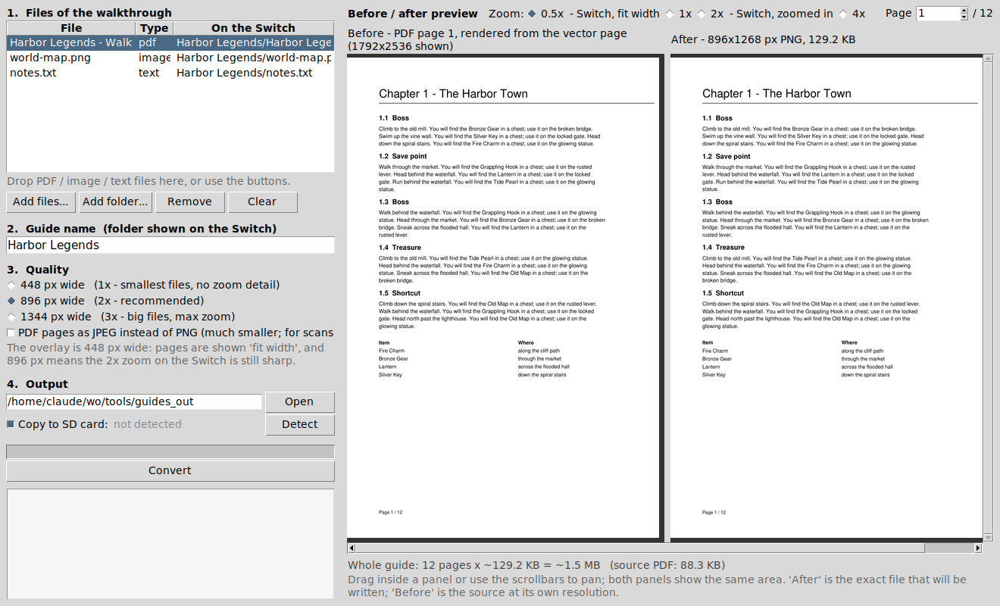
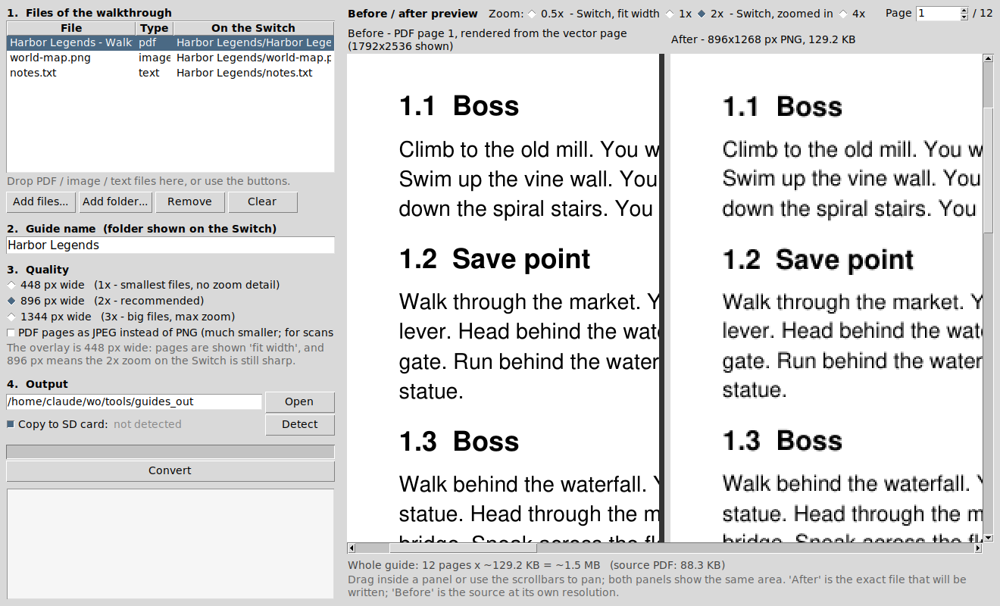
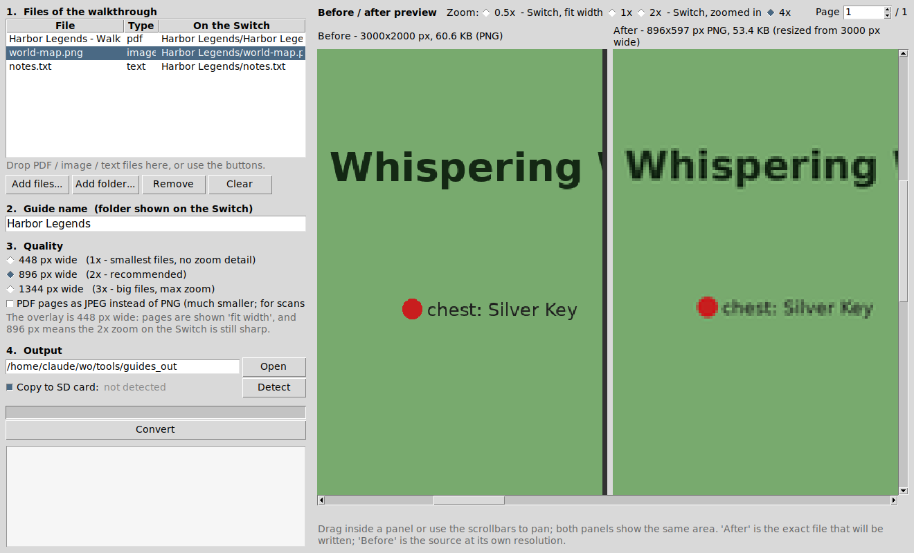

# 🕹️ Walkthrough Overlay

Read game guides while you play — **text files and image/PDF pages, on top of any game**, as a
Nintendo Switch overlay built on [libultrahand](https://github.com/ppkantorski/libultrahand).

Version 2 is a from-scratch rewrite of the original libtesla fork: the memory model, the
readers and the file browser are new. What changed and why is at the bottom.

<!-- Switch screenshots: press the capture button with the overlay open (Ultrahand ->
     Settings -> "opaque screenshots" keeps the overlay in the picture), copy the files from
     sd:/Nintendo/Album/ into docs/ as switch-menu.jpg / switch-text.jpg / switch-pages.jpg,
     then move this table out of the comment:
| Main menu | Text reader | Page viewer |
|---|---|---|
|  |  |  |
-->

---

## Features

- **Text reader** (`.txt` `.md` `.log` `.nfo`) — word wrap, monospace or proportional font
  (ASCII maps stay aligned), adjustable size, bookmarks, resume where you stopped, 10 % jumps.
  Works on multi-megabyte guides: only a window of the file is ever in memory.
- **Image / page viewer** (`.png` `.jpg`) — a folder of images is a document, pages flip with
  L / R, zoom & pan, fit-width or fit-page, resume on the last page.
  Images are decoded **streaming** and downscaled on the fly to whatever memory the overlay
  currently has, so a 4000×3000 photo opens fine in a 4 MB heap (just smaller).
- **PDF** — converted on the PC by `tools/guide2switch.py` into page images (2× overlay
  resolution, so zooming stays readable). Rendering PDFs on the console itself is not possible
  in an overlay's memory budget.
- Favorites (★), dedicated `guides/` folder, full SD browsing, natural sort (`page_2` < `page_10`).
- Live view of the overlay heap on the main menu (used / total / free for images).

## Installation

1. Requirements: CFW with **Ultrahand Overlay** (and its `nx-ovlloader+`). Works with a plain
   Tesla setup too, but with less memory for images.
2. Copy `WalkthroughOverlay.ovl` to `sd:/switch/.overlays/`.
3. Put your guides in `sd:/switch/WalkthroughOverlay/guides/` (created on first launch):
   - `.txt` files directly,
   - one **folder per PDF / scanned guide**, containing its page images.
4. Open Ultrahand → Walkthrough.

More memory for big pages: Ultrahand → Settings → **Memory expansion** (8 MB or more).
The main menu shows how much you have.

## Preparing guides on the PC

Double-click **`tools/guide2switch.bat`** (Python 3 required; PyMuPDF, Pillow and the
drag-and-drop helper are installed automatically the first time).



1. Drop the files of one walkthrough into the window — a PDF, screenshots, a `.txt`… — or use
   *Add files*. The *On the Switch* column shows where each file will land.
2. Give the guide a **name**: that is the folder you will see on the Switch.
3. Check the **Before / After** preview. *After* is the exact file that will be written (its
   size is shown, with an estimate for the whole guide); *Before* is the source at its own
   resolution. Drag to pan — both panels always show the same area. The zoom levels are the
   ones the overlay uses: 0.5x is how a page looks "fit width" on the Switch, 2x is the
   overlay zoomed in.
4. **Convert**. The result lands in `tools/guides_out/<name>/` and, if an SD card with
   `switch/WalkthroughOverlay/guides` is plugged in, is copied onto it.

At 2x, text stays sharp with the default 896 px quality — the PNG is a real rendering of the
page, not a compressed photo of it:



Where you *do* lose something is a huge image with tiny labels: at 4x the 896 px version of
this 3000 px map is visibly soft. That is what the preview is for — switch to 1344 px, or keep
896 px if you never zoom that far:



What the conversion does — nothing more:

| Input | Output |
|---|---|
| `guide.pdf` | pages **rendered** as lossless PNG, 896 px wide by default (2× the overlay); JPEG optional for scanned PDFs |
| `map.png` / `photo.jpg` | resized with Lanczos to ≤ 896 px wide; PNG stays lossless, JPEG is re-encoded at quality 85; smaller images are left untouched |
| `notes.txt` | re-encoded UTF-8 with LF line endings |

A single PDF becomes the guide itself (`<name>/page_001.png …`); with several PDFs or PDFs
mixed with images, each PDF gets its own sub-folder next to the images.

Command line: `python tools/guide2switch.py --name "Zelda TOTK" guide.pdf map.png -o out`, or
`--cli` to batch-convert `tools/input/<guide name>/…`.

## Controls

### Lists
| Button | Action |
|---|---|
| A | Open |
| Y | Star / unstar (Favorites) |
| B | Back |

### Text reader
| Button | Action |
|---|---|
| Left stick / D-pad ↑↓ | Scroll (hold to speed up) |
| Left stick / D-pad ←→ | Page up / down |
| ZL / ZR | Jump 10 % back / forward |
| Y | Bookmark the top line |
| L / R | Previous / next bookmark |
| Right stick ↑↓ | Font size (click: reset) |
| X | Monospace ↔ proportional |
| − | Show / hide the legend |
| B | Back (position saved) |

### Image viewer
| Button | Action |
|---|---|
| Left stick / D-pad | Pan |
| Right stick ↑↓ | Zoom (click: back to fit-width) |
| X | Fit width ↔ fit page |
| L / R | Previous / next page |
| ZL / ZR | 10 pages back / forward |
| − | Show / hide the legend |
| B | Back (page saved) |

Settings, favorites, bookmarks and resume positions live in
`sd:/config/WalkthroughOverlay/config.ini`.

## Building

Needs devkitPro with `devkitA64`, `libnx`, and the `switch-libpng`, `switch-libjpeg-turbo`,
`switch-curl`, `switch-mbedtls`, `switch-zlib` portlibs (all part of the `switch-dev` /
`switch-portlibs` groups).

```
make            # -> WalkthroughOverlay.ovl
make clean
```

On Windows with MSYS2, add `export MSYS2_ARG_CONV_EXCL='*'` to `~/.bashrc` first (or use
`build.bat`). `lib/libultrahand/` is vendored from
[ppkantorski/libultrahand](https://github.com/ppkantorski/libultrahand); to update it, replace
the folder.

With Docker and no local toolchain:

```
docker run --rm -v "$PWD":/w -w /w devkitpro/devkita64 make
```

## Project layout

```
source/ include/
  main.cpp            overlay entry point
  GuiMain             main menu + heap gauge, help screen
  GuiBrowser          folder / favorites lists
  GuiTextReader       text reader        ← TextDocument (windowed file access)
  GuiImageViewer      image/page viewer  ← ImageLoader (streaming PNG/JPEG decode)
  FullscreenView      root element + shared header/footer drawing
  Config              settings / favorites / bookmarks / resume (INI)
  Files               listing, kinds, natural sort
  Memory              heap total / used / free (mallinfo)
  Input               key repeat helper
tools/guide2switch.py PC converter core (PDF → pages, images, text)
tools/guide2switch_gui.py the window around it (drag & drop, before/after preview)
docs/                 screenshots for this README
lib/libultrahand      UI library (GPLv2, vendored)
```

## Why the rewrite

The v1 fork (libtesla) was unreliable for three structural reasons:

- **Images**: it decoded the whole file into RGBA8 with stb_image (a 1080p PNG = 8 MB, more than
  an overlay's entire heap) and then called `drawBitmap` with the *zoomed* size, reading past
  the end of the buffer. v2 streams rows out of libpng / libjpeg-turbo, box-filters them to a
  size chosen from the free heap measured at that moment, stores RGBA4444 (2 bytes/px) and
  samples that buffer when drawing, so zoom never touches memory again.
- **Text**: duplicated `if (ZR) … else if (ZR)` branches, a second block that scrolled again
  every frame, font size changing 60× per second while the stick was held (and underflowing an
  unsigned), 100 lines drawn regardless of the screen. v2 has one input path with key repeat,
  word wrap and only draws what fits.
- **Lists**: `for (size_t i = idx - 1; i >= 0; --i)` — an unsigned loop that never ends.
  v2 uses libultrahand's own `List`.

## Credits

- [libultrahand](https://github.com/ppkantorski/libultrahand) by ppkantorski (GPLv2)
- [libtesla](https://github.com/WerWolv/libtesla) by WerWolv
- Original idea: [TextReaderOverlay-NX-Plus](https://github.com/Storm21CH/TextReaderOverlay-NX-Plus)

## License

GPLv2 (see `LICENSE`), the same license as libultrahand which this overlay links against.
